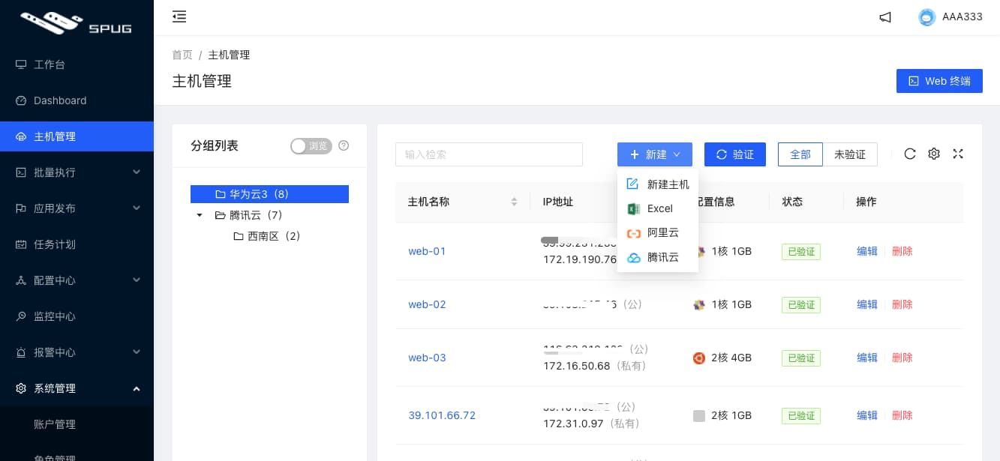
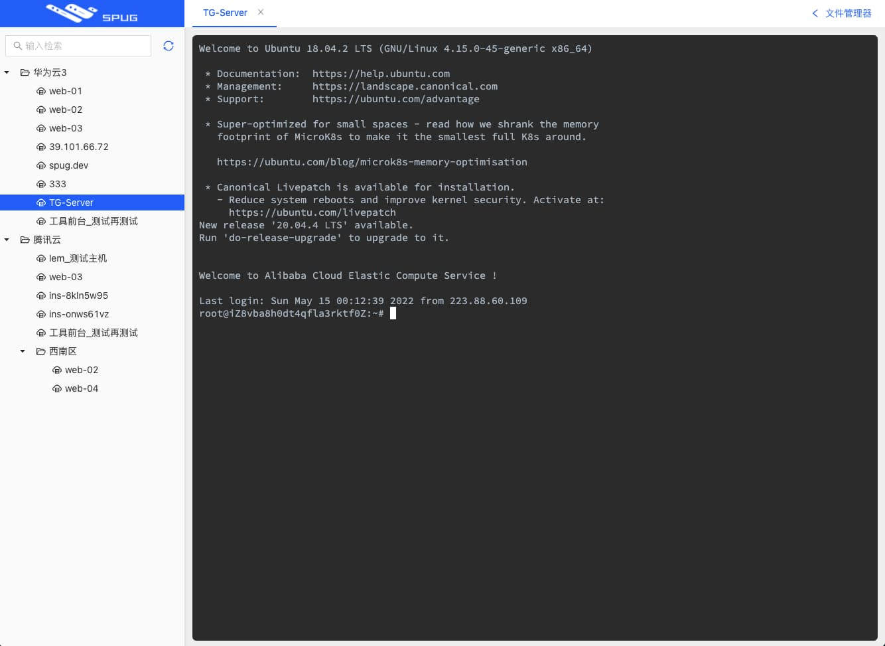
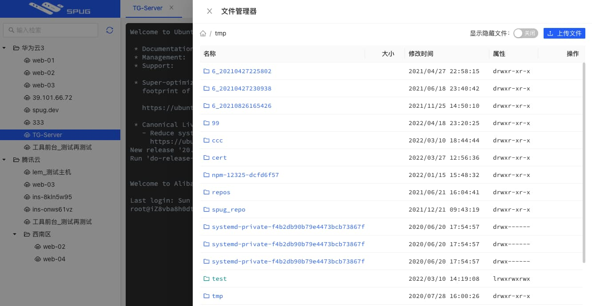
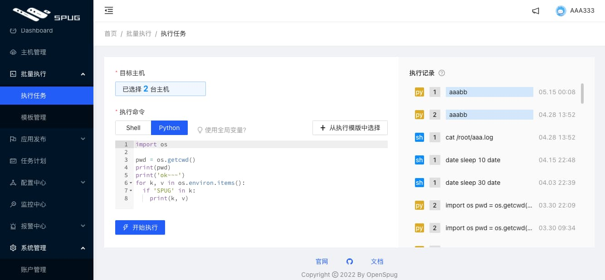
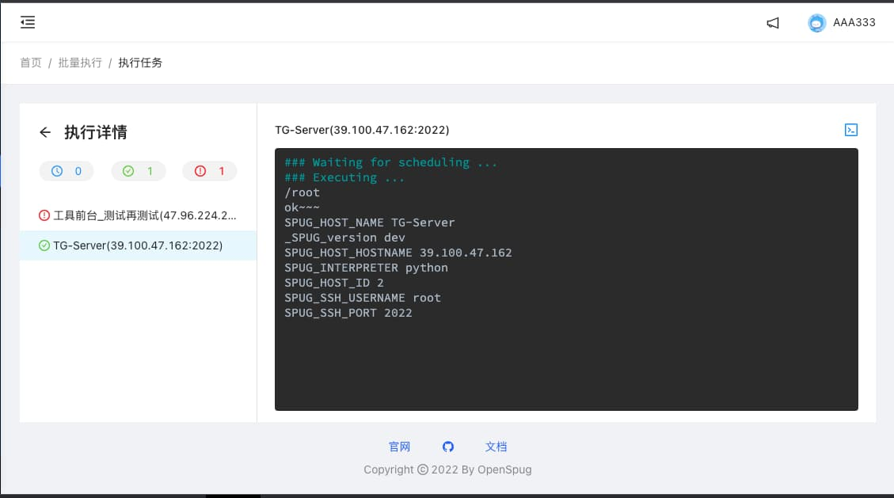
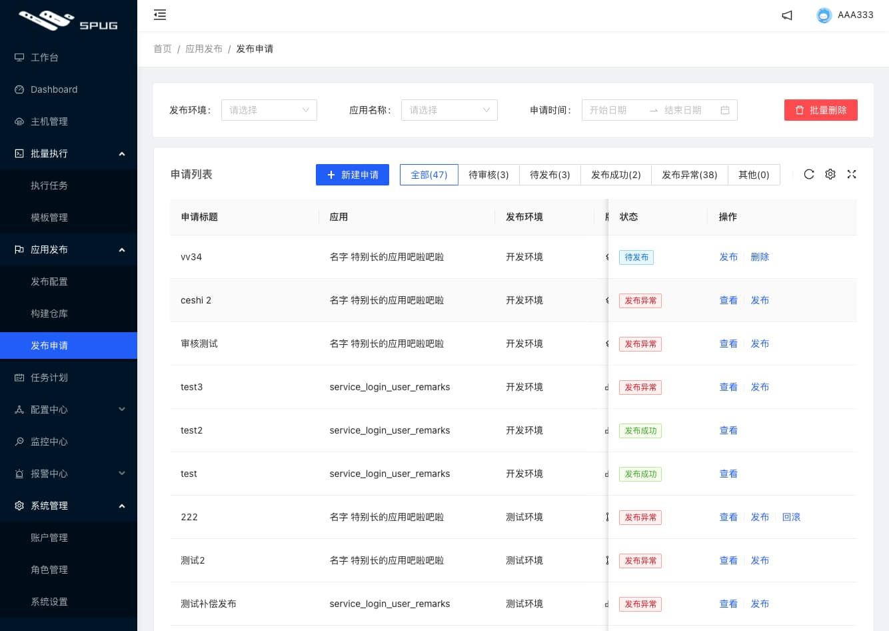
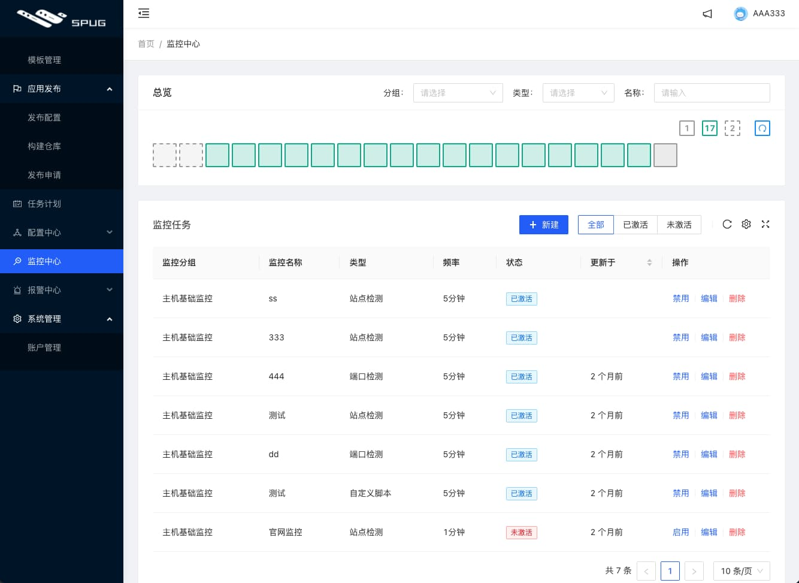
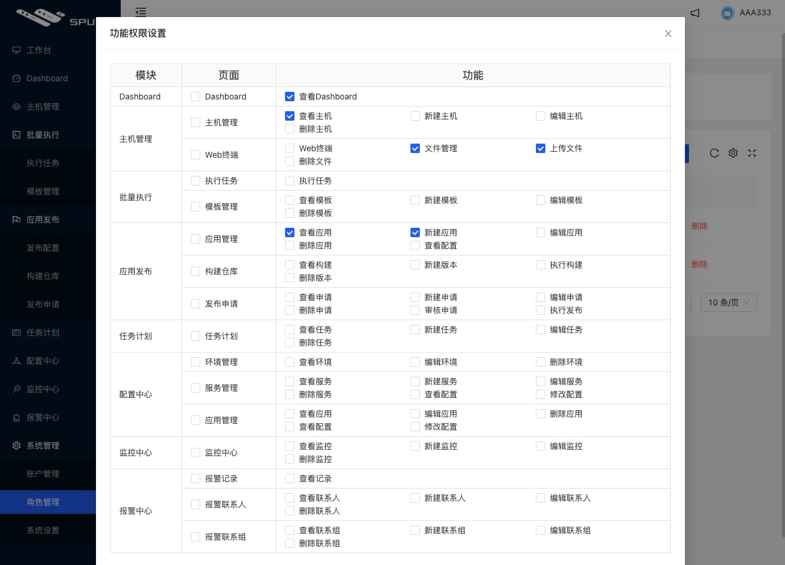

# 简介


FSRE 是基于Spug开发的开源项目，功能丰富，是一款企业级的轻量化，自动化运维平台，整合了主机管理、主机批量执行、主机在线终端、文件管理、应用发布部署、在线任务计划、配置中心、监控、报警等一系列功能。


# 🔥推送助手

推送助手是一个集成了电话、短信、邮件、飞书、钉钉、微信、企业微信等多通道的消息推送平台，用户只需要调用一个简单的URL，就可以完成多通道的消息推送，


# 特性

- **批量执行**: 主机命令在线批量执行
- **在线终端**: 主机支持浏览器在线终端登录
- **文件管理**: 主机文件在线上传下载
- **任务计划**: 灵活的在线任务计划
- **发布部署**: 支持自定义发布部署流程
- **配置中心**: 支持KV、文本、json等格式的配置
- **监控中心**: 支持站点、端口、进程、自定义等监控
- **报警中心**: 支持短信、邮件、钉钉、微信等报警方式
- **优雅美观**: 基于 Ant Design 的UI界面
- **开源免费**: 前后端代码完全开源


# 环境要求

* Python 3.6+
* Django 2.2
* Node 12.14
* React 16.11

# 安装部署

## docker 安装：

以下安装步骤使用 `Centos7.x` 操作系统。

### 1. 安装docker


```bash
yum install -y yum-utils
yum-config-manager --add-repo https://download.docker.com/linux/centos/docker-ce.repo
yum install docker-ce docker-compose-plugin
systemctl enable docker
systemctl start docker
```


### 2. 创建docker-compose.yml

```yaml
cat > docker-compose.yml <<'EOF'
version: "3.3"
services:
  db:
    image: mariadb:10.8.2
    container_name: spug-db
    restart: always
    command: --port 3306 --character-set-server=utf8mb4 --collation-server=utf8mb4_unicode_ci
    volumes:
      - /data/spug/mysql:/var/lib/mysql
    environment:
      - MYSQL_DATABASE=spug
      - MYSQL_USER=spug
      - MYSQL_PASSWORD=spug.cc
      - MYSQL_ROOT_PASSWORD=spug.cc
  spug:
    image: openspug/spug-service
    container_name: spug
    privileged: true
    restart: always
    volumes:
      - /data/spug/service:/data/spug
      - /data/spug/repos:/data/repos
    ports:
      # 如果80端口被占用可替换为其他端口，例如: - "8000:80"
      - "80:80"
    environment:
      - MYSQL_DATABASE=spug
      - MYSQL_USER=spug
      - MYSQL_PASSWORD=spug.cc
      - MYSQL_HOST=db
      - MYSQL_PORT=3306
    depends_on:
      - db
 
EOF 
```


### 3. 启动容器

```bash
docker compose up -d
```


### 4. 初始化

以下操作会创建一个用户名为 `admin` 密码为 `spug.dev` 的管理员账户，可自行替换管理员账户/密码。

```bash
docker exec spug init_spug admin spug.dev
```


### 5. 访问测试

在浏览器中输入 `http://localhost:80` 访问（默认账户密码在第4步初始化时设置）。


## 手动安装：

### 克隆项目

```
mkdir -p /data
cd /data
git clone --depth=1 https://github.com/BianChengVIP/Linux_SRE_P1.git
```


### 安装环境

```
yum install -y epel-release
yum install -y git mariadb-server mariadb-devel python3-devel gcc openldap-devel redis nginx supervisor python36 rsync sshfs


```


### 创建运行环境

```
cd /data/spug/spug_api
python3 -m venv venv
source venv/bin/activate
pip install -U pip -i https://pypi.tuna.tsinghua.edu.cn/simple/
pip install -r requirements.txt -i https://pypi.tuna.tsinghua.edu.cn/simple/
pip install gunicorn mysqlclient -i https://pypi.tuna.tsinghua.edu.cn/simple/


```


### 配置数据库

```
systemctl start mariadb
systemctl enable mariadb
mysql -e "create database spug default character set utf8mb4 collate utf8mb4_unicode_ci;"
mysql -e "grant all on spug.* to spug@127.0.0.1 identified by 'spug.dev'"
mysql -e "flush privileges"
```


### 修改后端配置  

```
cat <<'EOF' >spug/overrides.py
DEBUG = False
ALLOWED_HOSTS = ['127.0.0.1']
DATABASES = {
    'default': {
        'ATOMIC_REQUESTS': True,
        'ENGINE': 'django.db.backends.mysql',
        'NAME': 'spug',
        'USER': 'spug',
        'PASSWORD': 'spug.dev',
        'HOST': '127.0.0.1',
        'OPTIONS': {
            'charset': 'utf8mb4',
            'sql_mode': 'STRICT_TRANS_TABLES',
        }
    }
}
EOF
```


### 初始化数据库

```
cd /data/spug/spug_api
python manage.py updatedb
```


### 创建默认管理员账户

```
python manage.py user add -u admin -p spug.dev -s -n 管理员


mkdir /etc/supervisord.d/
```


### 创建启动服务脚本

```
cat <<'EOF' >/etc/supervisord.d/spug.ini
[program:spug-api]
command = bash /data/spug/spug_api/tools/start-api.sh
autostart = true
stdout_logfile = /data/spug/spug_api/logs/api.log
redirect_stderr = true
[program:spug-ws]
command = bash /data/spug/spug_api/tools/start-ws.sh
autostart = true
stdout_logfile = /data/spug/spug_api/logs/ws.log
redirect_stderr = true
[program:spug-worker]
command = bash /data/spug/spug_api/tools/start-worker.sh
autostart = true
stdout_logfile = /data/spug/spug_api/logs/worker.log
redirect_stderr = true
[program:spug-monitor]
command = bash /data/spug/spug_api/tools/start-monitor.sh
autostart = true
stdout_logfile = /data/spug/spug_api/logs/monitor.log
redirect_stderr = true
[program:spug-scheduler]
command = bash /data/spug/spug_api/tools/start-scheduler.sh
autostart = true
stdout_logfile = /data/spug/spug_api/logs/scheduler.log
redirect_stderr = true
EOF
```


```
cat > /etc/yum.repos.d/nginx.repo <<'EOF'
[nginx]
name=nginx repo
baseurl=http://nginx.org/packages/centos/7/$basearch/
gpgcheck=0
enabled=1
EOF

yum install -y epel-release
yum install -y git mariadb-server mariadb-devel python3-devel gcc openldap-devel redis nginx supervisor python36 rsync sshfs
sed -i 's/ default_server//g' /etc/nginx/nginx.conf
```


### 创建前端nginx配置文件

```
  cat <<'EOF' >/etc/nginx/conf.d/spug.conf
server {
        listen 80;
        server_name 10.0.0.200;     # 修改为自定义的访问域名
        root /data/spug/spug_web/build/;
        client_max_body_size 20m;   # 该值会影响文件管理器可上传文件的大小限制，请合理调整
        gzip  on;
        gzip_min_length  1k;
        gzip_buffers     4 16k;
        gzip_http_version 1.1;
        gzip_comp_level 7;
        gzip_types       text/plain text/css text/javascript application/javascript application/json;
        gzip_vary on;
        location ^~ /api/ {
                rewrite ^/api(.*) $1 break;
                proxy_pass http://127.0.0.1:9001;
                proxy_read_timeout 180s;
                proxy_redirect off;
                proxy_set_header X-Forwarded-For $proxy_add_x_forwarded_for;
        }
        location ^~ /api/ws/ {
                rewrite ^/api(.*) $1 break;
                proxy_pass http://127.0.0.1:9002;
                proxy_http_version 1.1;
                proxy_set_header Upgrade $http_upgrade;
                proxy_set_header Connection "Upgrade";
                proxy_set_header X-Forwarded-For $proxy_add_x_forwarded_for;
        }
        location / {
                try_files $uri /index.html;
        }
}
EOF
```


### 关闭Firewalld 和 selinux

```
systemctl stop firewalld
systemctl disable firewalld
setenforce 0
sed -i 's/SELINUX=enforcing/SELINUX=disabled/g' /etc/sysconfig/selinux
sed -i 's/SELINUX=enforcing/SELINUX=disabled/g' /etc/selinux/config
```


### 设置开机启动并开启服务

```
systemctl enable --now nginx
systemctl enable --now redis
systemctl enable --now supervisord


mkdir build
cd build/

# 上传前端文件
# 参考教程：https://spug.cc/docs/install
```


# 预览

### 主机管理



#### 主机在线终端



#### 文件在线上传下载



#### 主机批量执行




#### 应用发布



#### 监控报警



#### 角色权限




## License & Copyright

[AGPL-3.0](https://opensource.org/licenses/AGPL-3.0)